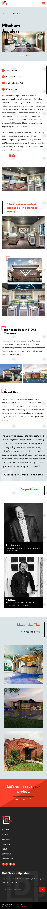
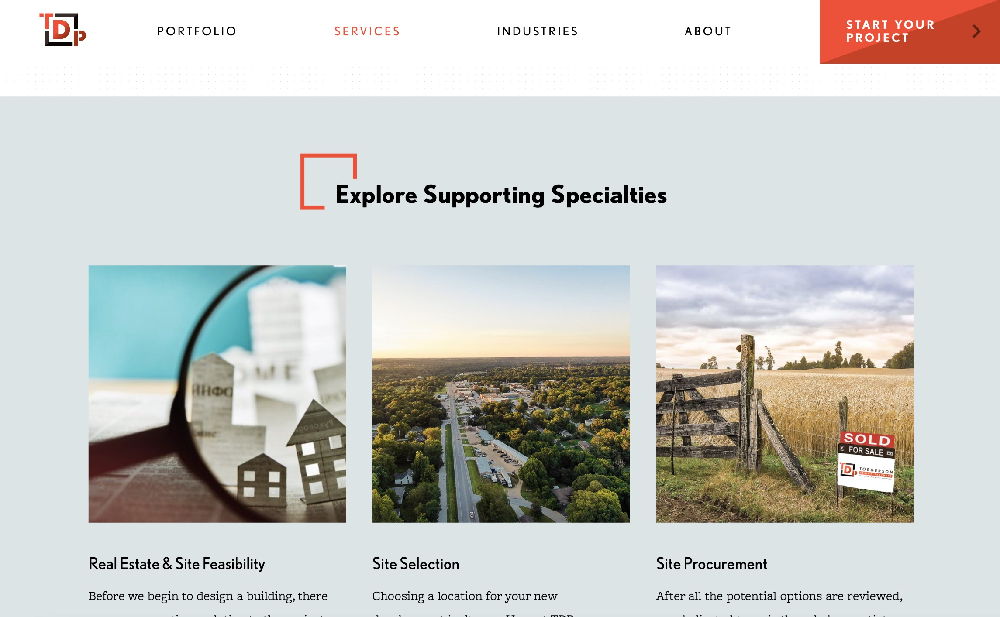
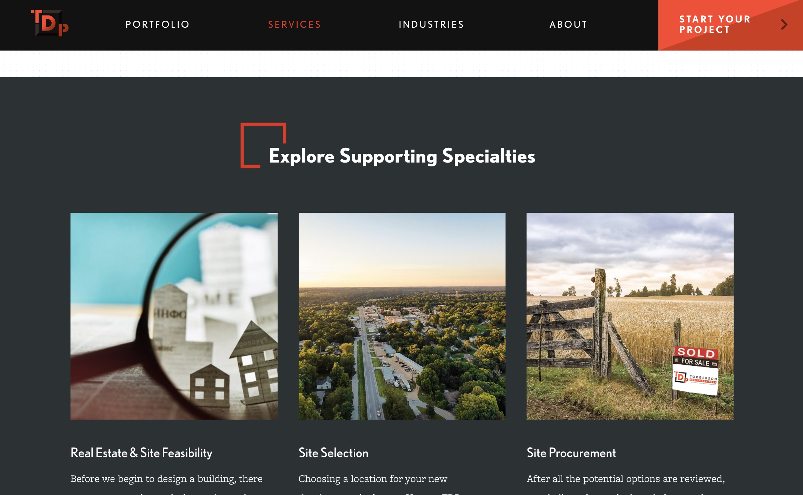
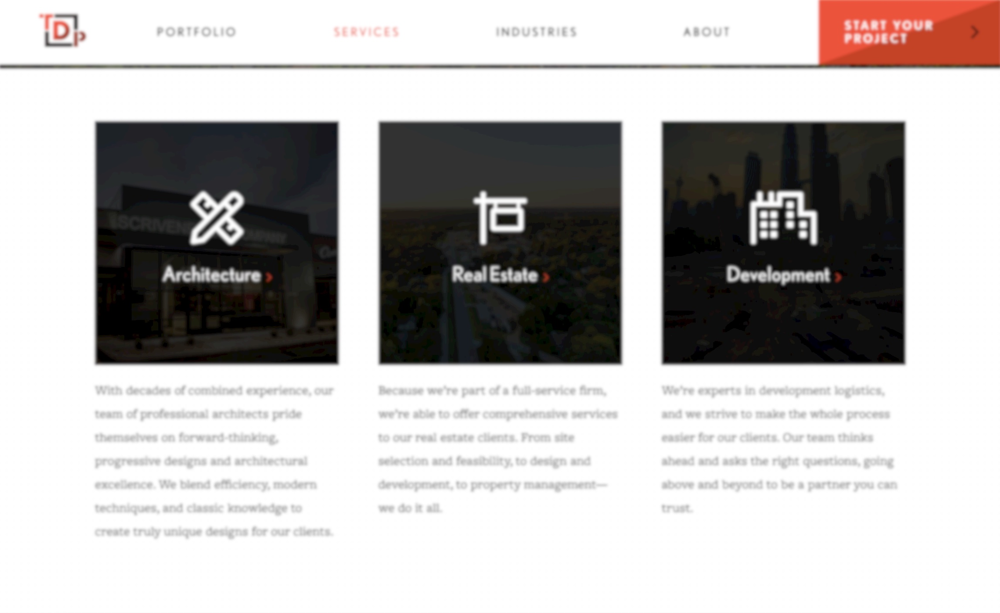

# Procesverslag
Markdown is een simpele manier om HTML te schrijven.  
Markdown cheat cheet: [Hulp bij het schrijven van Markdown](https://github.com/adam-p/markdown-here/wiki/Markdown-Cheatsheet).

Nb. De standaardstructuur en de spartaanse opmaak van de README.md zijn helemaal prima. Het gaat om de inhoud van je procesverslag. Besteedt de tijd voor pracht en praal aan je website.

Nb. Door *open* toe te voegen aan een *details* element kun je deze standaard open zetten. Fijn om dat steeds voor de relevante stuk(ken) te doen.

## Jij

  
uitwerken voor kick-off werkgroep

  ### Auteur:
  Kevin Boere

  #### Je startniveau:
  Blauw/Zwart

  #### Je focus:
  zowel responsive als surface plane (voor de uitdaging)
 

## Je website

  
uitwerken voor kick-off werkgroep

  ### Je opdracht:
  https://www.tdp-arch.com/   (Torgerson Design Partners is een full-service architectenbureau en commerciële ontwerpgroep)

  #### Screenshot(s) van de eerste pagina (small screen): 
  "About" Pagina | https://www.tdp-arch.com/about  
  

  #### Screenshot(s) van de tweede pagina (small screen):
  Portfolio item: "Mitchum Jewelers" Pagina | https://www.tdp-arch.com/portfolio/mitchum-jewelers  
  
 

## Toegankelijkheidstest 1/2 (week 1)

  
uitwerken na test in 1e werkgroep

  ### Bevindingen
  Lijst met je bevindingen die in de test naar voren kwamen:
  <h2>Retina laat los</h2>
  <ul>
    <li>Ziet heel weinig</li>
    <li>Wanneer je over elementen gaat vegroten ze iets</li>
    <li>Foto's zijn heel vaag</li>
    <li>Wordt een beetje misselijk & koppijn</li>
    <li>Vergt veel focus</li>
  </ul>

  #### <h3>Screenreader</h3>
  Door op "tab" te drukke gaat ie naar het volgende element. Sommige teksten en H1 slaat ie over en aan het eind zegt ie altijd hoofd... waarom is dat?
  Onzichtbare linkjes leest ie ook voor met name in het menu
  

  <b>Hier een omschrijving van hoe het opgelost kan worden (met indien nodig afbeeldingen)</b>
  Ik moet er sowieso voor orgen dat alle teksten in een "p" tag staan. Dat zou 1 probleem denk ik al verhelpen en is semantisch ook correcter.

  #### <h3>Muis en Toetsenbord </h3>
  <b>Hier korte omschrijving (met indien nodig afbeeldingen)</b>
  De tab toets werkt goed en met de pijltjes (boven en onder) kun je gemakkelijk door de website heen

  #### <h3>Motoriek (shocks, elastiekjes)</h3>
  <b>Hier korte omschrijving (met indien nodig afbeeldingen)</b>
   Tijdens het testen met een elastiekje en shocks kwam ik erachter dat de website moeilikjker te navigeren is. 
  In de video ieronder zul je zien dat het wel lukt maar je moet er veel moeite voor doen en soms lukt het dan ook gwn niet.
  
  video staat hier!
  
  

https://user-images.githubusercontent.com/112857604/193881713-7bc4dbb5-6368-4cb1-ac6e-16bfad572a7b.mp4

  
  Verder is het ook vrij irritant wanneer je niet al je vingers kunt gebruiken. als ik bijvoorbeeld iets wilde gaan opzoeken in de website doe je dat vaaak met al je vingers. met het elastiekkje om 3 vingers heen gebonden lukte dit slechter en drukte je soms een extra toets in die je niet wilde.

  #### <h3>Visueel (brillen, contrast, kleurenblind, dark/light). </h3>
  <b>Hier korte omschrijving (met indien nodig afbeeldingen)</b>
   Darkmode: ik heb vid de inspector tool, darkmode getest om te zien wat er verschilt. en eigenlijk is dat niet heel veel op alle standaard witte         achtegronden na, deze worden zwart. Hierdoor worden sommige dingen wel duidelijker (zie screenshot) of meer belangrijk dan dat het zou moeten zijn.     Het contrast wordt iets groter ook vind ik.
  
   VS   
  
  Blurred: Door dat je via de inspector tool een website blurred kan laten lijken, kun je goed nagaan wat mensen met een slechte visie zien. Wat ik       vooral merk is dat kleine lange teksten niet leesbaar worden en feel focus vergen. Het duidelijkst is wle als je iets een andere kleur markeert, dat     valt op en is dan best goed te lezen.
  
  
  
  Kleurenblind: Ik heb ook getest welke kleuren verandern met welke kleur blindheid.
  
  Met Protanopia: Alle rode elmenten worden een groen/donkergroen. Zwart, wit en grijs blijven hetzelfde.
  Met Deuteranopia: Alle rode elemnten worden een fellere groen/donkergroen. Zwart, wit en grijs blijven hetzelfde.
  Met Tritanopia: Alle rode elementen worden een fel roze en in foto's worden groen, geel en blauwe elementen ook rood/roze. Zwart, wit en grijs blijven   hetzelfde.
  Met Achromatopsia: Wordt heel de website zwart wit en grijs. contrast is dus belangrijk hierbij.

  <b>Hier een omschrijving van hoe het opgelost kan worden (met indien nodig afbeeldingen)</b>

## <h2>Breakdownschets (week 1)</h2>

  
uitwerken na afloop 2e werkgroep

  ### de hele pagina: 
  
  Desktop
  
   
  Ipad
  
   
  Mobiel
  

  ### dynamisch deel (bijv menu): 
  

## <h2>Voortgang 1 (week 2)</h2>

  
uitwerken voor 1e voortgang

  ### Stand van zaken
  Ik heb de eerste feedback ronde gemist. hie rheb ik robert ook via teams iest over gemeld. Uteindelijk afgesproken dat ik de eerste feedback mocht      overslaan omdat ik andere studenten veel aan het helpen was.
  
  De eerste week ging wel hele makkelijk tot woensdag. daarna niet meer zoveel gedaan vanwege reden.. Wel begon ik op desktop en niet op mobiel.
  Ik vind dat zelf handiger omdat ik dan kleiner kan schalen en zie waar welk element moet komen. Ik kan dan ook makkelijker en voor mijn gvoel minder code hoeven te schrijven zodat het ook responive er goed uitziet.

  ### Agenda voor meeting
  samen met je groepje opstellen

  | student 1      | student 2          | student 3    | student 4        |
  | ---            | ---                | ---          | ---              |
  | dit bespreken  | en dit             | en ik dit    | en dan ik dat    |
  | en dat ook nog | dit als er tijd is | nog een punt | dit wil ik zeker |
  | ...            | ...                | ...          | ...              |

  ### Verslag van meeting
  <b>hier na afloop snel de uitkomsten van de meeting vastleggen<b>

  Nog geen feedback gekregen!

## <h2>Voortgang 2 (week 3)</h2>

  
uitwerken voor 2e voortgang

  ### Stand van zaken
  In de 2e week ben ik mij wat meer om mobiel gaan focussen. Ik begon namelijk op desktop maar had dat heel even acherwege gelaten.
  
  Ik had niet echte grote problemen, maar bleef soms te lang haken op een klein ding waarbij ik de volgende dag gelijk ag wat het probleem was.

  ### Agenda voor meeting
  samen met je groepje opstellen

  | student 1      | student 2          | student 3    | student 4        |
  | ---            | ---                | ---          | ---              |
  | dit bespreken  | en dit             | en ik dit    | en dan ik dat    |
  | en dat ook nog | dit als er tijd is | nog een punt | dit wil ik zeker |
  | ...            | ...                | ...          | ...              |

  ### Verslag van meeting
  hier na afloop snel de uitkomsten van de meeting vastleggen

   - CSS classes verminderen
  - CSS opschonen
  - verder met mobiel gaan, desktop even achterwege laten!
  

## <h2>Voortgang 3 (week 4)</h2>

  
uitwerken voor 3e voortgang

  ### Stand van zaken
  In deze week heb ik beide pagina's afgekregen. Wel zijn er wat kleine dingen die ik nog moest doen.
  Zo had ik een probleem met sldier op de 2e pagina en waren er accesibilty dingetjes die beter konden.
  
  verder verliep het vrij goed en ging het me vrij makkleijk af.

  ### Agenda voor meeting
  samen met je groepje opstellen

  | student 1      | student 2          | student 3    | student 4        |
  | ---            | ---                | ---          | ---              |
  | dit bespreken  | en dit             | en ik dit    | en dan ik dat    |
  | en dat ook nog | dit als er tijd is | nog een punt | dit wil ik zeker |
  | ...            | ...                | ...          | ...              |

  ### Verslag van meeting
  hier na afloop snel de uitkomsten van de meeting vastleggen

  - Figcaption bij figure tag
  - w3c vaildator
  - alt bij images zetten
  - accibility dingetjes oppakken
   

## <h2>Toegankelijkheidstest 2/2 (week 4)</h2>

  
uitwerken na test in 8e werkgroep

  ### Bevindingen
  <b>Lijst met je bevindingen die in de test naar voren kwamen (geef ook aan wat er verbeterd is):</b>
   
  - Menu werkt niet met tab toets
  - Paragraven worden nu wel allemaal gelezen
  - hij geeft de titel van de sectie aan

  #### Screenreader
 Alle tekst wordt nu wel voorgelezen. Ik heb ook in elke sectie een Heading gebruikt en daarom krijg je een soort intro over welke sectie het gaat.

  #### Muis en Toetsenbord 
  de tab toets raakt alles aan dus dat werkt goed en ook de pijlen doen hun ding!

  #### Motoriek (shocks, elastiekjes)
  Ik heb met het shock arbandje getest wat ik nu wel en niet kon en dit is eigenlijk gewoon hetzelfde gebleven. soms een verkeerde toets ingedrukt. en soms ging het beter.

  #### Visueel (brillen, contrast, kleurenblind, dark/light). 
  Kleuren en zichtbaarheid is nog steeds hetzelfde als dat op de originele website ook is.

## <h2>Eindgesprek (week 5)</h2>

  
uitwerken voor eindgesprek

  ### Je uitkomst - karakteristiek screenshots:
  
  Zie url van website. (Verder ook niet zo'n goed idee wat dit inhoudt)

  ### Dit ging goed/Heb ik geleerd: 
  In deze weken heb ik vooral dingen opgefrist voor mezelf. en heb ik ander goed kunnen helpen.
  Ik werk al 3/4 jaar met HTML & CSS en een heeeeeeeeel klein beetje JS. 
  
  Dingen die goed gingen:
  - het gebruik van Display:Flex & Grid.
  - het snel opzetten van HTML Structuur
  - Alle CSS classes verwijderen en in het CSS bestand aanpassen
  - Mensen uitleggen hoe ze het anders kunnen doen en helpen
  - Het beter gaan begrijpen van JS 
  - Makkelijk positioneren van elementen d.m.v. CSS
  
  Ik heb niet echt een afbeelding die dit kan weergeven, maar hopelijk kun je aan mn code zien dat het ging ;)

  ### Dit was lastig/Is niet gelukt:
 Het lastigste of eigenlijk eerder wat ik niet heb gedaan is om vanaf mobiel te beginnen.
 Voor mij is het makkelijker om van groot naar klein te schalen omdat ik het gevoel heb dat ik minder code hoef te schrijven en dat wprdt dan ook veel minder warrig.
 
 Een ander puntje dat ik lastig vond is wanneer je Aria-label gebruikt en wanneer Title en dat soort attributen...
 Die dingen zijn wel erg belangrijk voor bijvoorbeeld screenreaders. 

## <h2>Bronnenlijst</h2>

  
continu bijhouden terwijl je werkt

  Nb. Wees specifiek ('css-tricks' als bron is bijv. niet specifiek genoeg).

  1. https://codepen.io/robertspier/pen/PoeJpVO (Foldable menu dingen meegekeken en over geschreven)
  2. https://codepen.io/Smn91/pen/oNEQmWp (de animatie "geleend")
  3. https://dev.to/ljcdev/introduction-to-scroll-animations-with-intersection-observer-d05 (wanneer het inzicht is speelt animatie af)
  4. https://codepen.io/dudleystorey/pen/DJqNKP (slider van images before and after)
  5. https://codepen.io/Mahii-/pen/eYMPxoX (slider image page 2)

